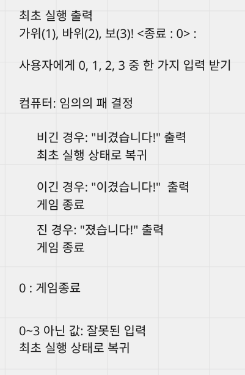
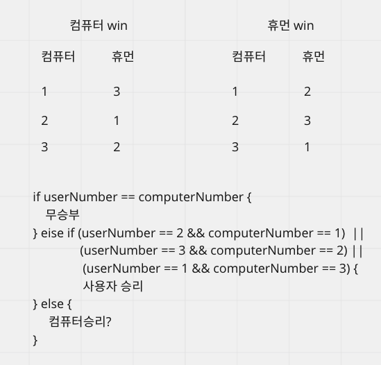
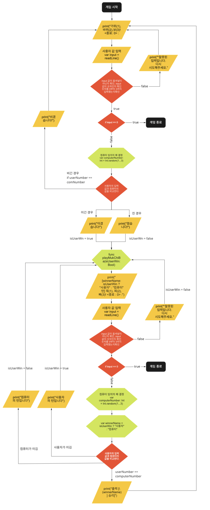

## iOS 커리어 스타터 캠프

### 묵찌빠 프로젝트 저장소

##### Created by 지스, Soll (6B조)

## 프로젝트 설명

1. 사용자에게 0,1,2,3 중 한 가지를 입력받아 가위바위보 게임을 진행합니다. 비기면 가위바위보 게임을 계속 진행합니다.
2. 이긴 사람이 묵찌빠게임의 턴을 가져갑니다.
3. 사용자에게 0,1,2,3 중 한 가지를 입력받아 묵찌빠 게임의 승패를 결정합니다. 사용자의 턴일 때 잘못 입력받으면 컴퓨터의 턴으로 넘어갑니다.
4. 0을 입력받으면 게임을 종료합니다.

## 의사 코드

### step1

### step2

>  Step1 의 게임결과를 받아옴
>
> > 비긴 경우 -> 다시 가위바위보
> > 승패 갈림 -> 묵찌빠 진행

>  Bool 유저턴인가? true false
>
> > 컴퓨터 = 랜덤숫자 (1...3)

> 출력 [*** 턴] 묵(1), 찌(2), 빠(3)! <종료 : 0> :
>
> > 0-> 게임 종료
> > 잘못 입력 -> 유저턴 false
> > 1,2,3 -> 진행

> 사용자 == 컴퓨터 ->
>
> > 출력 [*** 승리]
>
> 사용자 != 컴퓨터 ->
>
> > 이긴 쪽이 턴을 가져감.
> > 출력 [***의 턴입니다]

## 플로우 차트

## Naming

1. Message: enum = 프로그램 실행에 필요한 메세지들을 저장합니다.
2. RockPaperScissors: enum = 가위바위보 게임 진행에 필요한 case입니다. 사용자와 컴퓨터가 낼 수 있는 패입니다.
3. MukChiBa: enum = 묵찌빠 게임 진행에 필요한 case입니다. 사용자와 컴퓨터가 낼 수 있는 패입니다.
4. GameMode: enum = printGameMenu(gameMode:winnerName:) 함수 호출 시 필요한 게임의 모드 case 입니다.

## Functions

1. isGameEnd(userNumber:) = 사용자의 숫자를 입력 받아 게임의 종료 여부를 반환합니다.
2. printGameMenu(gameMode:winnerName:) = 게임모드를 열거형 GameMode 중 하나를 입력받아 출력하는 함수입니다. winnerName은 필수 전달인자가 아닙니다.
3. receiveUserNumber(gameMode:) = 게임모드를 열거형 GameMode 중 하나를 입력받고, 사용자의 입력값이 유효한지 판단하여 Int? 타입으로 반환합니다.
4. playRockPaperScissors() = 가위바위보 게임을 진행하는 함수입니다. 가위바위보 승패를 판단하는 기능이 포함되어 있습니다.
5. playMukChiBa(isUserWin:) =  묵찌빠 게임을 진행하는 함수입니다. 묵찌빠 게임의 승패를 판단하는 기능이 포함되어 있습니다. 전달인자 isUserWin은 가위바위보 게임에서 사용자가 승리했는지를 판단하는 전달인자입니다.

