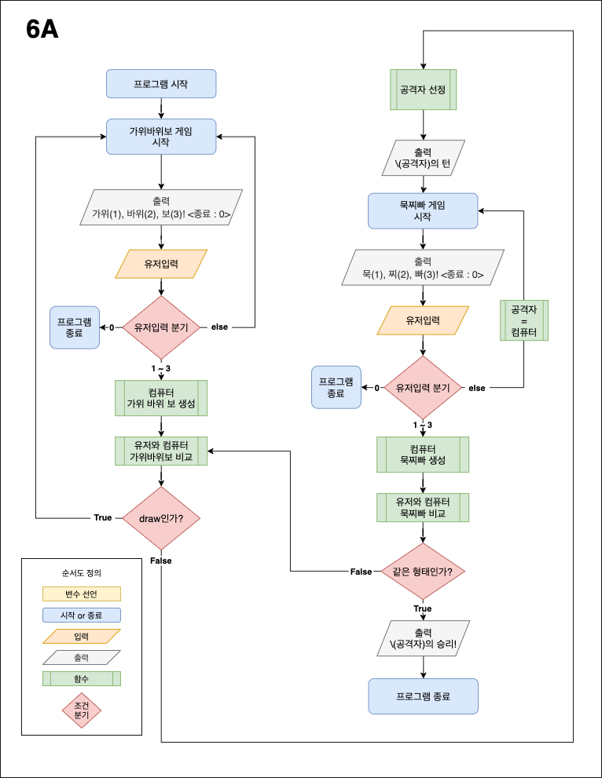

## iOS 커리어 스타터 캠프

## Flow Chart
### step1 flowchart

### step2 flowchart

### step1.
## 의사코드

1. 출력 : "가위(1), 바위(2), 보(3), 종료(0)"
2. 유저인풋
   - Int 를 입력받은 경우 -> 3번으로
   - Int 이외의 값을 입력받은 경우 -> 출력: 잘못된 입력입니다. -> 1번으로
3. 유저인풋 옵셔널 바인딩
   - 0 -> 프로그램 종료
   - 1, 2, 3 을 입력받은 경우 -> 게임시작
   - 1, 2, 3 이외의 값을 입력받은 경우 -> 출력: 잘못된 입력입니다. -> 1번으로
4. 컴퓨터 가위 바위 보 랜덤 생성
5. 유저인풋 -> 가위바위보 변환 -> 판정
6. 게임결과 출력 -> 1번으로

### step2.
## 의사코드
1. 출력 : “가위(1),바위(2),보(3),종료(0)”
2. 유저입력
    - Int를 입력받은 경우 ->
    - Int이외의 값을 입력받은 경우 -> 출력: “잘못된 입력입니다.” -> 1번으로
3. 유저인풋 언래핑
    - 0 -> 프로그램종료
    - 1,2,3 을 입력받은 경우 -> 가위바위보 게임시작
    - 1,2,3 이외의 값을 입력받은 경우 -> 출력: “잘못된 입력입니다.” -> 1번으로
4. 컴퓨터 가위바위보 랜덤 생성
5. 유저입력을 가위바위보로 변환
6. 유저와 컴퓨터 비교
    - 비겼는가? -> 1번으로
    - 아닌가? -> 7번으로
7. 가위바위보 이긴자에게 공격자 선정 (만듦)
8. 가위바위보를 묵찌빠로 변환 (만듦)
9. ——— 반복문 ———
10. 출력 : “[(공격자) 턴] 묵(1),찌(2),빠(3),종료(0)” (만듦)
11. 유저입력
     - Int를 입력받은 경우 -> 9번으로
     - Int이외의 값을 입력받은 경우 -> 출력: “잘못된 입력입니다.” -> 9번으로 -> 공격자 = 컴퓨터
12. 유저인풋 언래핑
     - 0 -> 프로그램종료
     - 1,2,3 을 입력받은 경우 -> 묵찌빠 게임시작
     - 1,2,3 이외의 값을 입력받은 경우 -> 출력: “잘못된 입력입니다.” -> 9번으로 -> 공격자 = 컴퓨터
13. 컴퓨터 묵찌빠 랜덤 생성 (만듦)
14. 유저입력을 묵찌빠로 변환
15. 공격자 방어자 비교
     - 같은 형태인 경우 -> [공격자]의 승리! -> 프로그램 종료
     - 다른 형태인 경우 -> 7번으로