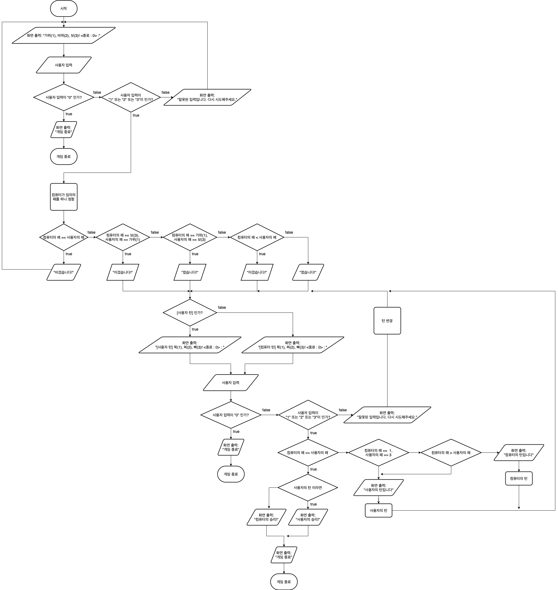

# 묵찌빠 게임

## STEP 2 순서도



# 코드 설명

## STEP 1

### ExpectedHand 열거형

가위바위보 게임에서 나올 수 있는 손의 모양은 3가지입니다.
> 가위(1), 바위(2), 보(3)

저희는 가위, 바위, 보 사이의 관계를 rawValue 간의 대소비교를 통해 구현하기 위해
열거형 내부에 사용자 정의 연산자(`<`)를 구현했습니다.

이때, 가위(1)가 보(3)를 이기기 때문에 if문으로 true 를 리턴하도록 만들었습니다.
그 외에 경우는 rawValue 값이 클 때 true 가 리턴되도록 만들었습니다.

```swift
enum ExpectedHand: String, CaseIterable, Comparable {
    static func < (lhs: ExpectedHand, rhs: ExpectedHand) -> Bool {
        if lhs == .paper, rhs == .scissors {
            return true
        }
        return lhs.rawValue < rhs.rawValue
    }
    
    case scissors = "1"
    case rock = "2"
    case paper = "3"
}
```

#### 주의

`String` 타입끼리 비교하기 때문에, 비교할 값이 **1자리**여야 합니다.  
`case.rawValue`가 **2자리** 이상의 문자열 이라면, 아래 코드를 사용하십시오.
```swift
import Foundation
let compare = "11".compare("2", options: [.numeric])
print(compare == .orderedAscending)
```

## STEP 2

### `readMukChiBa()` 함수

해당 함수의 목적은 묵찌빠 게임에서 사용자에게 입력받는 손모양 번호를 교차시켜 주기 위함입니다.

> 가위(1), 바위(2), 보(3)  
> 묵(1), 찌(2), 빠(3)

가위바위보 게임을 묵찌빠 게임까지 확장할 때, 저희가 집중한 포인트는 찌(2)는 가위(1)로, 묵(1)은 바위(2)로 입력을 받아야만 STEP 1 에서 만들어두었던 열거형 `ExpectedHand` 를 재사용할 수 있다는 점이었습니다.

먼저, 사용자의 입력을 받는 것은 STEP 1 에서 만들어둔 `readUserInput()` 함수를 재사용했습니다.  
옵셔널 값은 `guard let` 을 통해 잡아주고, `switch`문 을 활용해서, 묵과 찌를 교차시켰습니다.  
빠(3)는 기존 그대로 보(3)로 동일하게 받았습니다.

함수의 네이밍은 `readUserInput()` 하고 맥락을 맞추기 위해 `read` 로 시작했고, 묵찌빠 게임의 영문 표현인 `Muk-Chi-Ba` 를 붙여서 만들었습니다.

```swift
func readMukChiBa() throws -> ExpectedHand? {
    guard let input = try readUserInput() else {
        return nil
    }
    
    switch input {
    case .scissors:
        return .rock
    case .rock:
        return .scissors
    case .paper:
        return .paper
    }
}
```


### `runMukChiBa(_:)` 함수

```swift
switch gameResult {
    case .draw where whoseTurn == .userTurn:
        print(Message.userWin)
        print(Message.exit)
    case .draw where whoseTurn == .computerTurn:
        print(Message.computerWin)
        print(Message.exit)
```

무승부일 경우, 턴을 가진이가 승리합니다. 이를 위해 `whoseTurn` 을 입력받고, `where` 절로 `whoseTurn` 조건에 따라 다른 결과가 나오도록 했습니다.

### Message 열거형

출력문을 저장하기 위한 열거형을 만들었습니다.

타입 프로퍼티를 쓴 이유는 메모리를 덜 쓰기 위함입니다. 인스턴스를 매번 만들면 메모리를 더 쓰게 될 것 입니다.
```swift
enum Message {
    static let menu: String = "가위(1), 바위(2), 보(3)! <종료 : 0> : "
    static let exit: String = "게임 종료"
    static let menuUserTurn: String = "[사용자 턴] 묵(1), 찌(2), 빠(3)! <종료 : 0> : "
    static let menuComputerTurn: String = "[컴퓨터 턴] 묵(1), 찌(2), 빠(3)! <종료 : 0> : "
    static let userWin: String = "사용자의 승리!"
    static let computerWin: String = "컴퓨터의 승리!"
}
```
