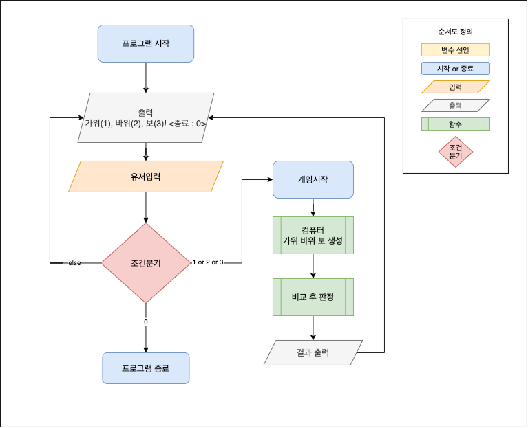

## iOS 커리어 스타터 캠프

## Flow Chart

### step1.
## 의사코드

1. 출력 : "가위(1), 바위(2), 보(3), 종료(0)"
2. 유저인풋
   - Int 를 입력받은 경우 -> 3번으로
   - Int 이외의 값을 입력받은 경우 -> 출력: 잘못된 입력입니다. -> 1번으로
3. 유저인풋 옵셔널 바인딩
   - 0 -> 프로그램 종료
   - 1, 2, 3 을 입력받은 경우 -> 게임시작
   - 1, 2, 3 이외의 값을 입력받은 경우 -> 출력: 잘못된 입력입니다. -> 1번으로
4. 컴퓨터 가위 바위 보 랜덤 생성
5. 유저인풋 -> 가위바위보 변환 -> 판정
6. 게임결과 출력 -> 1번으로
