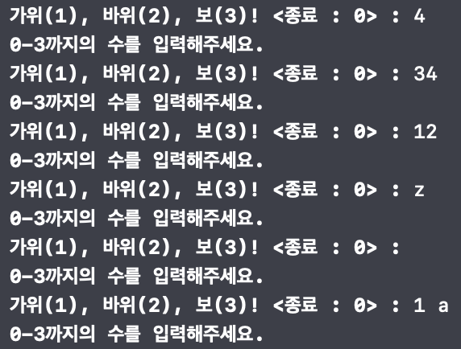
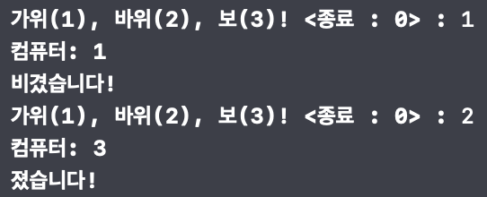
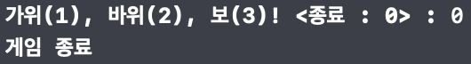
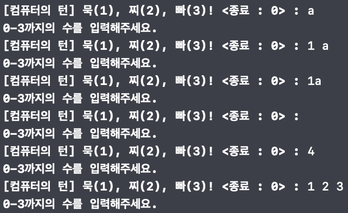
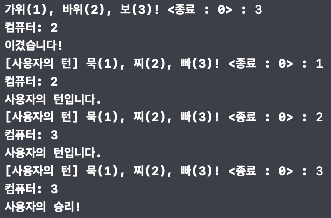
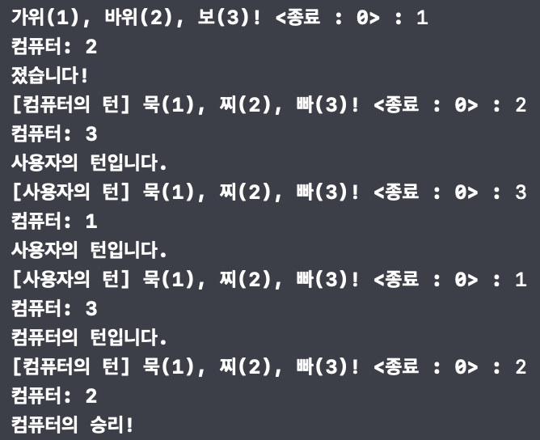
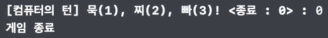

# 묵찌빠 프로젝트

## 0. 목차
[1. 소개](#1-소개)  
[2. 팀원](#2-팀원)  
[3. 타임라인](#3-타임라인)  
[4. 실행 화면](#4-실행-화면)  
[5. 트러블 슈팅](#5-트러블-슈팅)  
[6. 팀 회고](#6-팀-회고)  
[7. 참고 자료](#7-참고-자료)  

## 1. 소개
Step 1는 가위, 바위, 보 게임입니다. 사용자가 숫자 0, 1, 2, 3 중 하나를 입력하여 게임을 진행합니다. 0은 게임 종료, 1은 가위, 2는 바위, 3은 보를 나타냅니다. 1, 2, 3이 아닌 문자를 입력하면 잘못된 입력으로 처리되어 최초 실행 상태로 돌아갑니다. 또한 사용자의 패와 컴퓨터의 패가 같아 비긴 경우에도 최초 실행 상태로 복귀합니다. 컴퓨터는 1, 2, 3 중 랜덤한 숫자를 생성하여 자신의 패를 결정합니다. 사용자가 이기거나(컴퓨터가 지는), 사용자가 지는(컴퓨터가 이기는) 승패가 나누어지는 경우에 대해서만 Step 2로 넘어갑니다.  
Step 2는 묵, 찌, 빠 게임입니다. 사용자 입력에 대한 처리는 Step 1과 거의 같습니다. 1은 묵, 2는 찌, 3은 빠를 나타냅니다. Step 2부터는 턴을 활용하게 됩니다. Step 1에서 마지막으로 이긴 쪽이 처음에 턴을 가지게 됩니다. 사용자가 잘못된 입력을 할 경우에 컴퓨터로 턴이 넘어갑니다. 사용자의 패와 컴퓨터의 패가 동일할 경우, 턴을 쥐고 있는 쪽이 승리하게 됩니다. 패가 다른 경우에는 이긴 쪽이 턴을 쥐게 되고 Step 2의 최초 실행 상태로 복귀하여 게임을 계속 진행하게 됩니다.

## 2. 팀원
| [햄찌](https://github.com/kkomgi) | [가마](https://github.com/forseaest) |
| --- | --- |
|  |  |

## 3. 타임라인
| 날짜 | 내용 |
| --- | --- |
| 24.01.08 | Ground Rules 논의, Step1 코드 작성 |
| 24.01.09 | Step1 코드 마무리, Step1 PR |
| 24.01.10 | Step1 리팩토링, Step1 PR |
| 24.01.11 | Step2 코드 작성 |
| 24.01.12 | Step2 리팩토링, Step2 PR |

## 4. 실행 화면
### 4-1. Step 1
| 잘못된 입력 처리 | 진행 | 게임 종료 |
| --- | --- | --- |
|  |  |  |
### 4-2. Step 2
| 잘못된 입력 처리 | 진행 | 게임 종료 |
| --- | --- | --- |
|  | <br> |  |

## 5. 트러블 슈팅
### 5-1. 사용자 입력시, 문자열 유효성 검사
- 정규식을 이용하여 0에서 3까지의 한 자리 숫자만 받을 수 있도록 하였습니다.
- 또한 SQL Injection 을 예방하는데 도움을 줍니다.
- 사용된 정규식은, `#"^[0-3]$"#` 입니다.
### 5-2. 함수 리팩토링
- 작성한 수도코드를 토대로 작성된 코드에서 함수를 분리하여야 하였습니다. 그러나 그 과정에서 중복 소스가 생성되었습니다. 결국 함수 리팩토링하게 되었습니다.
- 특히 기존 코드에서 새 함수를 생성할 때는 함수의 이름을 직관적으로 만들었습니다. 유지보수에 용이하게 만드는 것이 포인트였기 때문입니다.
- 이렇게 완성된 함수만 호출하여 재사용할 수 있기에 작업시간이 줄어들고 프로그램 유지보수에도 굉장히 좋아질 거라고 예상합니다.
### 5-3. rawValue 사용
- enum의 형태에는 원시값 추가가 가능하여 불필요한 변수 선언을 하지 않게 되었습니다.
```Swift
  enum GamePlayer: String {
      case player = "사용자"
      case computer = "컴퓨터"
  ...
  }
```
- 튜플(Tuple)을 사용하여 하나의 케이스에 서로 다른 연관값들을 저장하였고 아래와 같이 원시값을 불러올 수 있도록 하였습니다.
- enum 에 대해서 새로운 방법을 알게 되는 계기가 되었습니다.
```Swift
switch gameResult {
case .win:
    whoseTurn = .player
    print("\(whoseTurn.rawValue)의 턴입니다.")
case .lose:
    whoseTurn = .computer
    print("\(whoseTurn.rawValue)의 턴입니다.")
default:
    print("\(whoseTurn.rawValue)의 승리!")
    loopFlag = false
}
```

## 6. 팀 회고
| 햄찌 | 가마 |
| --- | --- |
| 제시한 프로젝트를 의도를 이해하고 로직을 순서대로 구현하기 위하여 수도코드부터 작성하였습니다. 그리고 추후 유지보수를 생각하여 메소드 목적에 따라 정규식 규칙을 정할 수 있도록 하였습니다. 팀원과 같이 작업하면서 메소드의 재활용성에 대해서 더 생각할 수 있었습니다. | 사용자로부터 문자열을 입력 받을 때 정규식을 통해 유효성과 특정 필터링을 걸 수 있다는 것을 체득하게 되어, 프로그램뿐만 아니라 코딩 테스트에서도 활용할 수 있을 것 같다고 긍정적으로 생각되는 보람 찬 프로젝트였습니다. |

## 7. 참고 자료
- https://www.swift.org/documentation/api-design-guidelines/
- https://developer.apple.com/documentation/swift
- 클린 코드
- 객체지향의 사실과 오해
