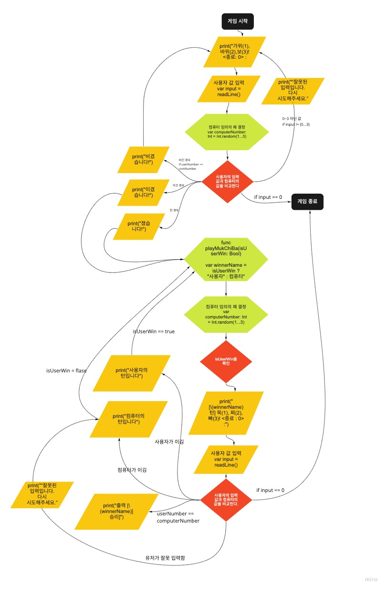

## iOS 커리어 스타터 캠프

### 묵찌빠 프로젝트 저장소

##### Created by 지스, Soll (6B조)

## 프로젝트 설명

- 묵찌빠 게임입니다.

  

## Step 1  

### 의사 코드

## Step2

### 의사 코드

>  Step1 의 게임결과를 받아옴

> > 비긴 경우 -> 다시 가위바위보

> > 승패 갈림 -> 묵찌빠 진행

> Bool 유저턴인가? true false

> > 컴퓨터 = 랜덤숫자 (1...3)

> 출력 [*** 턴] 묵(1), 찌(2), 빠(3)! <종료 : 0> :

> > 0-> 게임 종료

> > 잘못 입력 -> 유저턴 false

> > 1,2,3 -> 진행

> 사용자 == 컴퓨터 ->

> > 출력 [*** 승리]

> 사용자 != 컴퓨터 ->

> > 이긴 쪽이 턴을 가져감.

> > 출력 [***의 턴입니다]

### 플로우 차트

