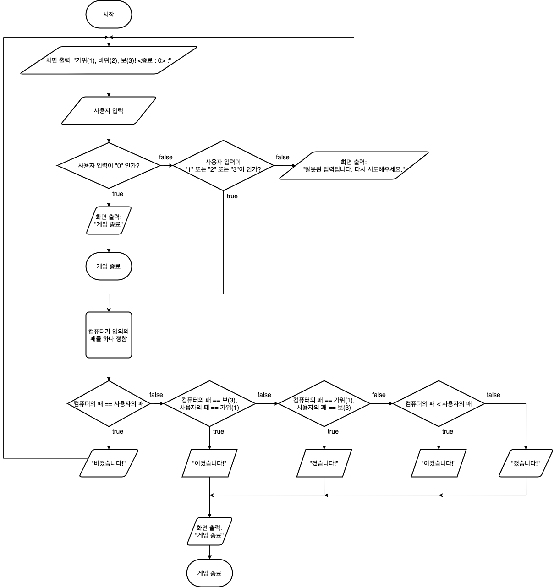

# 묵찌빠 게임

## STEP 1 순서도



## 코드 설명

### ExpectedHand 열거형

가위바위보 게임에서 나올 수 있는 손의 모양은 3가지입니다.
> 가위(1), 바위(2), 보(3)

저희는 가위, 바위, 보 사이의 관계를 rawValue 간의 대소비교를 통해 구현하기 위해
열거형 내부에 사용자 정의 연산자(`<`)를 구현했습니다.

이때, 가위(1)가 보(3)를 이기기 때문에 if문으로 true 를 리턴하도록 만들었습니다.
그 외에 경우는 rawValue 값이 클 때 true 가 리턴되도록 만들었습니다.

```swift
enum ExpectedHand: String, CaseIterable, Comparable {
    static func < (lhs: ExpectedHand, rhs: ExpectedHand) -> Bool {
        if lhs == .paper, rhs == .scissors {
            return true
        }
        return lhs.rawValue < rhs.rawValue
    }
    
    case scissors = "1"
    case rock = "2"
    case paper = "3"
}
```

#### 주의

`String` 타입끼리 비교하기 때문에, 비교할 값이 **1자리**여야 합니다.  
`case.rawValue`가 **2자리** 이상의 문자열 이라면, 아래 코드를 사용하십시오.
```swift
import Foundation
let compare = "11".compare("2", options: [.numeric])
print(compare == .orderedAscending)
```

### `Array.removeFirst()` 사용한 이유

`Array.randomElement()` 함수는 반환 타입이 옵셔널 입니다.  
옵셔널을 피하기 위해 `Array.removeFirst()` 함수를 사용했습니다.

```swift
var computerHand: ExpectedHand {
    var hands = ExpectedHand.allCases.shuffled()
    return hands.removeFirst()
}
```
