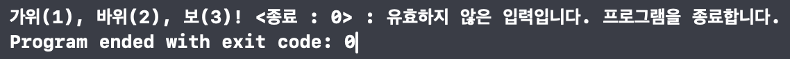
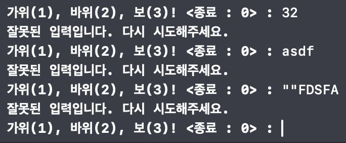
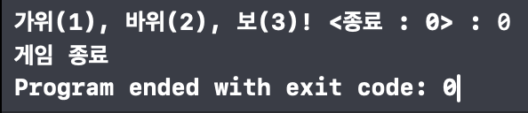
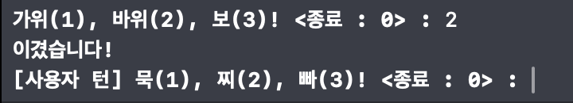
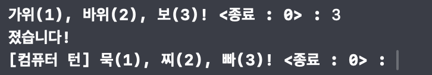
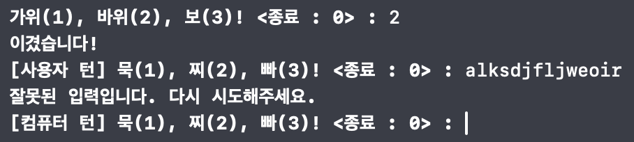
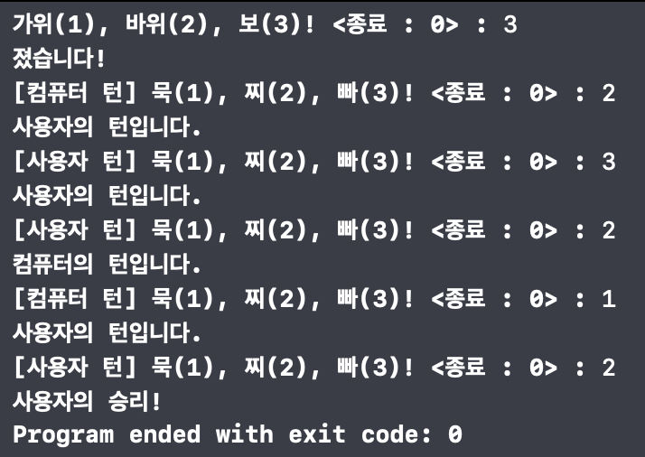
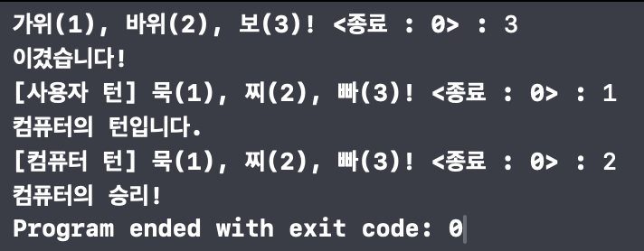

## 묵찌빠 프로젝트 ✊✌️✋

### 0. 목차
[1. 소개](#1-소개)  
[2. 팀원](#2-팀원)  
[3. 타임라인](#3-타임라인)  
[4. 순서도](#4-순서도)  
[5. 실행 화면](#5-실행-화면)    
[6. 트러블 슈팅](#6-트러블-슈팅)    
[7. 팀 회고](#7-팀-회고)    
[8. 참고 자료](#8-참고-자료)

### 1. 소개
사용자와 컴퓨터가 가위바위보 게임을 합니다. 사용자는 "가위, 바위, 보" 선택지를 선택하여 게임 결과를 확인합니다. 게임 결과에 따라서 묵찌빠 게임을 진행합니다.(이긴 경우, 이긴 플레이어의 턴으로 묵, 찌, 빠 게임을 시작합니다.)
사용자는 "묵, 찌, 빠" 중 하나의 선택지를 고릅니다.  이기거나 비길경우, 묵찌빠 게임을 다시 진행합니다. 사용자가 컴퓨터와 비길 경우, 턴을 쥐고 있는 플레이어가 승리하는 게임입니다.

### 2. 팀원
| [prism](https://github.com/PrismSpirit) | [danny](https://github.com/dannykim1215) |
| --- | --- |
|  |  |

### 3. 타임라인
| 날짜 | 제목 |
| --- | --- |
| 24.01.08(월) | 팀 그라운드 룰즈 및 플로우 차트 작성 |
| 24.01.09(화) | 가위바위보 게임 구현 |
| 24.01.10(수) | 분기 조건이 의도대로 작동하지 않던 오류 수정 |
| 24.01.11(목) | 묵찌빠 게임 구현 |
| 24.01.12(금) | 묵찌빠 프로젝트 README 작성 |


### 4. 순서도


### 5. 실행 화면
|  |
| :--- |
| **EOF 처리** |

|  |
| :--- |
| **잘못된 입력 처리** |

|  |
| :--- |
| **0을 입력해 게임 종료** |

|  |
| :--- |
| **가위바위보에 이기면 사용자의 턴으로 묵찌빠 시작** |


|  |
| :--- |
| **가위바위보에 지면 컴퓨터의 턴으로 묵찌빠 시작** |

|  |
| :--- |
| **사용자의 턴으로 묵찌빠 진행 중 잘못된 입력일 경우 턴을 넘김** |

|  |
| :--- |
| **비겼을 경우 사용자의 턴이면 사용자의 승리** |

|  |
| :--- |
| **비겼을 경우 컴퓨터의 턴이면 컴퓨터의 승리** |

### 6. 트러블 슈팅
#### 문제 상황
```swift
enum GameType {
    case RockPaperScissor
    case MukChiPpa
}

func verifyUserInput(userInput: userInput, gameToPlay: GameType) -> ()? {
    switch userInput {
    case "0":
        print("게임 종료")
        return nil
    case "1", "2", "3":
        return ()
    default:
        print("잘못된 입력입니다. 다시 시도해주세요.")
        return gameToPlay == .RockPaperScissor ? playRockPaperScissor() : playMukChiPpa()
}

func playRockPaperScissor() {
    // ...

    guard let _ = verifyUserInput(userInput: userInput, gameToPlay: .RockPaperScissor) else {
        return
    }

    // ...
}
```
사용자의 입력을 검증하는 과정 중 검증 함수 내부에서 직접 ```playRockPaperScissor()```를 재귀적으로 호출하도록 했으나, 잘못된 입력을 준 경우(ex. "4", "123", "asdf") guard let의 else문을 타고 return되지 않고 다음 코드블럭을 실행하게 되어 출력이 중복되는 등 의도하지 않은 동작이 발생했습니다.

#### 해결 방안 
```swift
enum InputError: Error {
    case EOF
    case InvalidInput
}

func readUserInput() throws -> String {
    guard let userInput = readLine() else {
        throw InputError.EOF
    }
    
    switch userInput {
    case "0", "1", "2", "3":
        return userInput
    default:
        throw InputError.InvalidInput
    }
}

func playRockPaperScissor() {
    // ...

    let userInput: String
    
    do {
        userInput = try readUserInput()
    } catch InputError.EOF {
        print("유효하지 않은 입력입니다. 프로그램을 종료합니다.")
        return
    } catch InputError.InvalidInput {
        print("잘못된 입력입니다. 다시 시도해주세요.")
        return playRockPaperScissor()
    } catch {
        print("Unexpected Error: \(error).")
        return
    }
    
    if userInput == "0" {
        print("게임 종료")
        return
    }

    // ...
}
```
Error Handling에 필요한 열거형 InputError를 선언해주었고 ```readUserInput()```함수에서 EOF 및 유효하지 않은 입력에 대한 error을 throw하도록 하고, 각 함수 내에서 do...catch문으로 예외처리를 하도록 하였습니다.

### 7. 팀 회고
#### 우리팀이 잘한 점 😍
- 프로젝트 첫날, 플로우 차트 작성하여, 프로젝트의 큰 방향성을 이해할 수 있었습니다.
- 코드 리팩토링 과정에서 각자 생각한 방법에 대해 서로 의견을 주고 받은 점이 잘했다고 생각합니다.
- 프로젝트 커밋 단위를 작게 가져가면서 프로젝트의 흐름을 이해하는데 많은 도움이 되었습니다.

#### 우리팀 개선할 점
- 파일 분리 및 기능별 함수 분리에 대해 공부가 더 필요하다고 생각합니다.

#### 서로에게 좋았던 점 피드백 😊
- Prism: 궁금한 점이 생겼을 때 그냥 넘어가지 않고 질문해주셨고, 질문해주신 부분에 대해 제가 아는 부분은 설명하면서 다시 한번 복습하게 되었고 제가 모르는 부분은 같이 찾아보며 서로 학습할 수 있어 좋았습니다 :smile:
- Danny: 버그를 끝까지 찾아내려는 집념과 끈기가 정말 배워야 한다고 생각했습니다. 그리고 어려운 점이 생겼을 때, 침착하게 같이 고민했던 부분이 좋았습니다. 
#### 서로에게 아쉬웠던 점 피드백
- 서로 많은 의견을 주고 받으며 아쉬움 없이 프로젝트를 마무리 할 수 있었습니다. 😁

### 8. 참고 자료
[Enumerations](<https://docs.swift.org/swift-book/documentation/the-swift-programming-language/enumerations/>)  
[Error Handling](<https://docs.swift.org/swift-book/documentation/the-swift-programming-language/errorhandling/>)  
[Control Flow](<https://docs.swift.org/swift-book/documentation/the-swift-programming-language/controlflow>)
